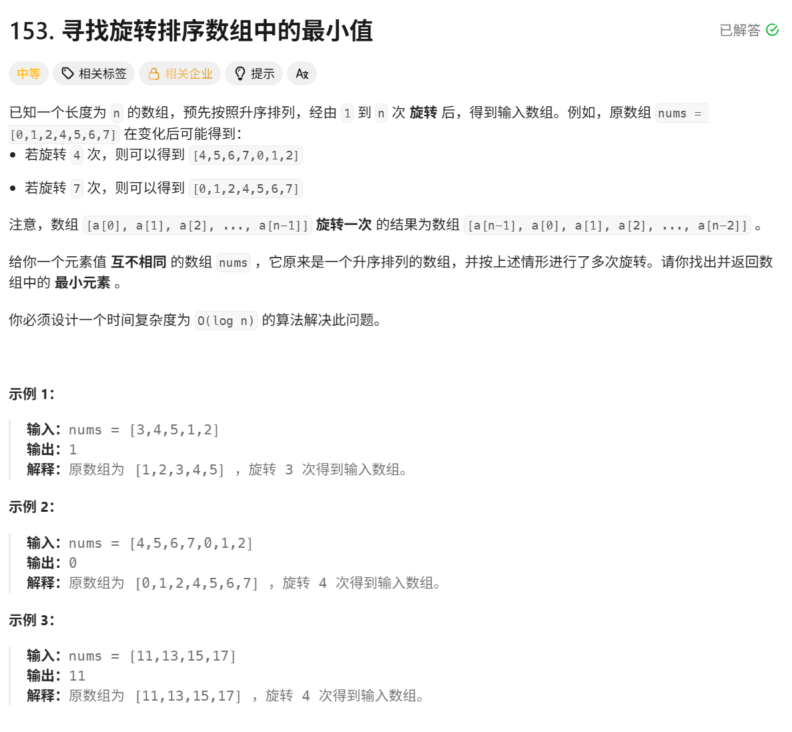

# 寻找旋转排序数组中的最小值

> [!question] 题目描述
> 

---

> [!light] 核心思路
> **破局点**：旋转后数组仍然由两个有序段组成，最小值一定落在“断点”右侧；比较 `nums[mid]` 与 `nums[right]` 就能判断最小值在哪一边。
> 1. 设定左右边界 `left = 0`、`right = n - 1`，在闭区间 `[left, right]` 内二分。
> 2. 取中点 `mid`：
>    - 若 `nums[mid] > nums[right]`，说明最小值在右半区，令 `left = mid + 1`。
>    - 否则最小值在左半区（含 `mid`），令 `right = mid`。
> 3. 当 `left == right` 时区间收敛，该位置即最小值下标。
> 4. 返回 `nums[left]`。

---

> [!code] 代码实现
>
> ```cpp
> #include <bits/stdc++.h>
> using namespace std;
>
> /*
>  * @lc app=leetcode.cn id=153 lang=cpp
>  *
>  * [153] 寻找旋转排序数组中的最小值
>  */
>
> // @lc code=start
> class Solution {
> public:
>     int findMin(vector<int>& nums) {
>         int left = 0;
>         int right = nums.size() - 1;
>
>         // 当 left == right 时，区间缩小为一个点，这就是我们要找的最小值
>         while (left < right) {
>             int mid = left + (right - left) / 2; // 防止整数溢出
>
>             if (nums[mid] > nums[right]) {
>                 // 最小值在 mid 的右边
>                 left = mid + 1;
>             } else {
>                 // 最小值在 mid 或 mid 的左边
>                 right = mid;
>             }
>         }
>
>         // 循环结束时 left == right，指向的就是最小值
>         return nums[left];
>     }
> };
> // @lc code=end
> ```
