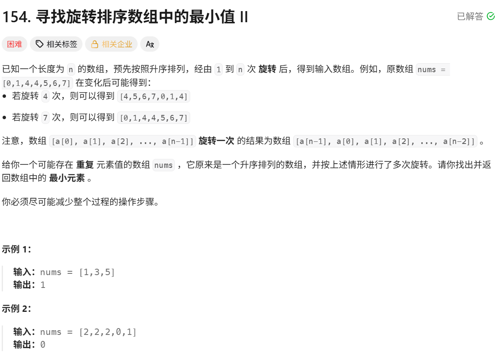

# 寻找旋转排序数组中的最小值 II

> [!question] 题目描述
> 

---

> [!light] 核心思路
> **破局点**：与 153题目 不同，本题允许重复元素；当 `nums[mid] == nums[right]` 时无法判断最小值在哪一侧，只能安全地缩小右边界。
> 1. 初始化 `left = 0`、`right = n - 1`，在闭区间 `[left, right]` 上二分。
> 2. 计算中点 `mid`，分三种情况：
>    - `nums[mid] > nums[right]`：最小值在右半区，`left = mid + 1`。
>    - `nums[mid] < nums[right]`：最小值在左半区（含 `mid`），`right = mid`。
>    - `nums[mid] == nums[right]`：无法判定方向，但可排除一个重复值，`right--`。
> 3. 循环结束时 `left == right`，该位置就是最小值下标。
> 4. 返回 `nums[left]`。
>
> 时间复杂度：平均 `O(log n)`，最坏（大量重复）退化为 `O(n)`；空间复杂度 `O(1)`。

---

> [!code] 代码实现
>
> ```cpp
> #include <bits/stdc++.h>
> using namespace std;
>
> /*
>  * @lc app=leetcode.cn id=154 lang=cpp
>  *
>  * [154] 寻找旋转排序数组中的最小值 II
>  */
>
> // @lc code=start
> class Solution {
> public:
>     int findMin(vector<int>& nums) {
>         int left = 0;
>         int right = nums.size() - 1;
>
>         while (left < right)
>         {
>             int mid = left + (right - left) / 2;
>
>             if (nums[mid] > nums[right])
>             {
>                 left = mid + 1;
>             }
>             else if (nums[mid] < nums[right])
>             {
>                 right = mid;
>             }
>             else
>             {
>                 right--;
>             }
>         }
>         
>         return nums[left];
>     }
> };
> // @lc code=end
> ```
