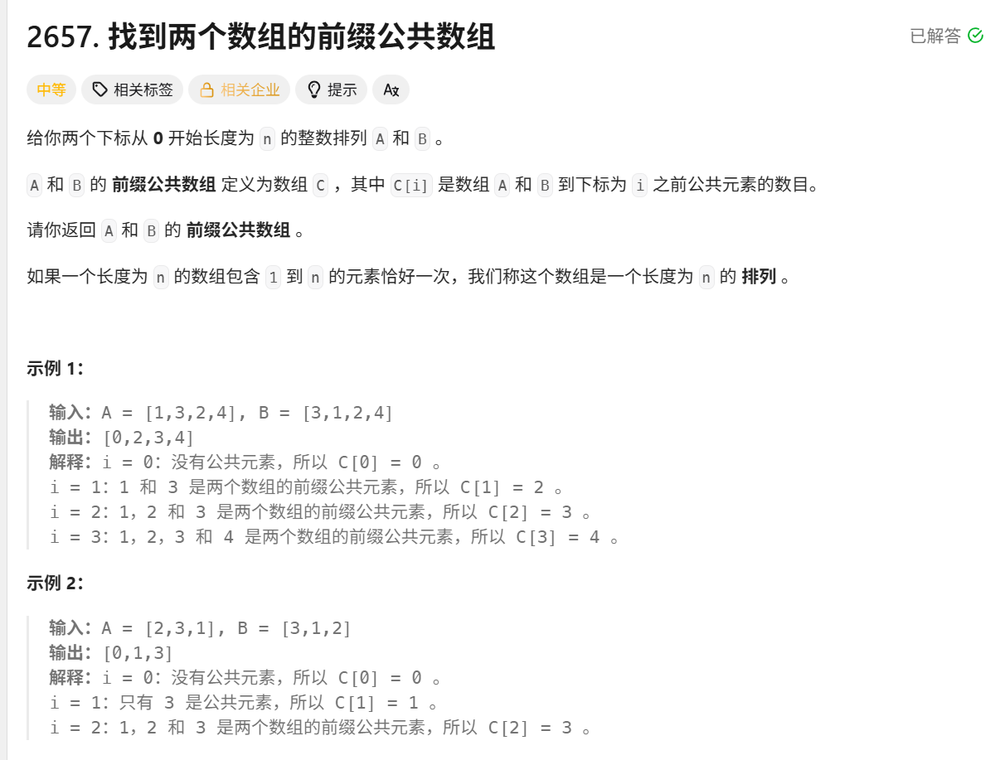

---
题号: 2657
tags:
  - 位运算
  - 数组
  - 哈希表
  - 待优化
---

# 找到两个数组的前缀公共数组

> [!question] 题目描述
> 

---

> [!light] 核心思路
> **破局点**：按前缀从左到右同步扫描 `A` 和 `B`，用哈希表统计每个数出现次数；某个数计数第一次达到 `2` 时，说明它同时出现在当前前缀 `A[0..i]` 与 `B[0..i]` 中，可将当前前缀公共元素数量加一。
>
> 1. 结果数组 `res` 中，`res[i]` 表示下标 `i` 的前缀公共元素个数，先继承 `res[i-1]`。
> 2. 处理 `A[i]`：`cnt[A[i]]++`，若自增后为 `2`，说明该元素刚好在两个数组前缀都出现过，`res[i]++`。
> 3. 处理 `B[i]`：同理执行 `cnt[B[i]]++`，若自增后为 `2`，再 `res[i]++`。
> 4. 即使 `A[i] == B[i]` 也不会重复计数：第一次加到 `1` 不触发，第二次加到 `2` 仅触发一次。
> 5. 遍历结束后返回 `res`。

---

> [!code] 代码实现
>
> ```cpp
> #include <bits/stdc++.h>
> using namespace std;
>
> /*
>  * @lc app=leetcode.cn id=2657 lang=cpp
>  *
>  * [2657] 找到两个数组的前缀公共数组
>  */
>
> // @lc code=start
> class Solution {
> public:
>     vector<int> findThePrefixCommonArray(vector<int>& A, vector<int>& B) {
>         unordered_map<int, int> map;
>         vector<int> res(A.size(), 0);
>
>         for (int i = 0; i < A.size(); i++)
>         {
>             if (i > 0) {
>                 res[i] = res[i - 1];
>             }
>
>             map[A[i]]++;
>             if (map[A[i]] == 2) {
>                 res[i]++;
>             }
>
>             map[B[i]]++;
>             if (map[B[i]] == 2) {
>                 res[i]++;
>             }
>         }
>         
>         return res;
>     }
> };
> // @lc code=end
> ```
