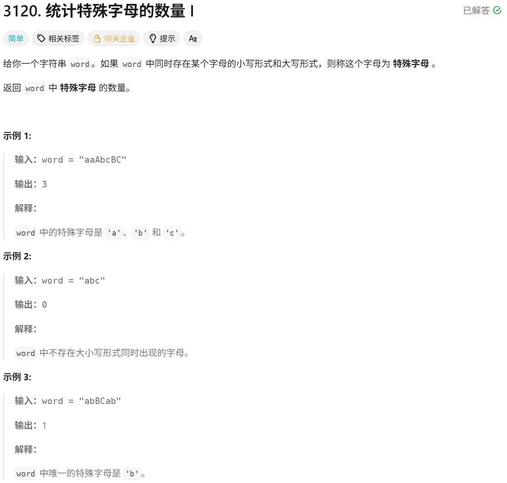

# 统计特殊字母的数量 I

> [!question] 题目描述
> 

---

> [!light] 核心思路
> 简单

---

> [!code] 代码实现
>
> ```cpp
> #include <bits/stdc++.h>
> using namespace std;
>
> /*
>  * @lc app=leetcode.cn id=3120 lang=cpp
>  *
>  * [3120] 统计特殊字母的数量 I
>  */
>
> // @lc code=start
> class Solution {
> public:
>     int numberOfSpecialChars(string word) {
>         int ans = 0;
>
>         vector<int> count(26, 0);
>         for (char c : word) {
>             if (c >= 'a' && c <= 'z') {
>                 if(count[c - 'a'] == 2){
>                     ans++;
>                     count[c - 'a'] = 3;
>                 }
>
>                 if(count[c - 'a'] != 3){
>                     count[c - 'a'] = 1;
>                 }
>             }
>             if (c >= 'A' && c <= 'Z') {
>                 if(count[c - 'A'] == 1){
>                     ans++;
>                     count[c - 'A'] = 3;
>                 }
>
>                 if(count[c - 'A'] != 3){
>                     count[c - 'A'] = 2;
>                 }
>             }
>         }
>         return ans;
>     }
> };
> // @lc code=end
> ```

---

> [!code] 哈希表实现
>
> ```cpp
> class Solution {
> public:
>     int numberOfSpecialChars(string word) {
>         unordered_set<char> lower, upper;
>         for (char c : word) {
>             if (c >= 'a' && c <= 'z') lower.insert(c);
>             else if (c >= 'A' && c <= 'Z') upper.insert(c);
>         }
>
>         int ans = 0;
>         for (char c = 'a'; c <= 'z'; ++c) {
>             if (lower.count(c) && upper.count(c - 'a' + 'A')) {
>                 ++ans;
>             }
>         }
>         return ans;
>     }
> };
> ```
