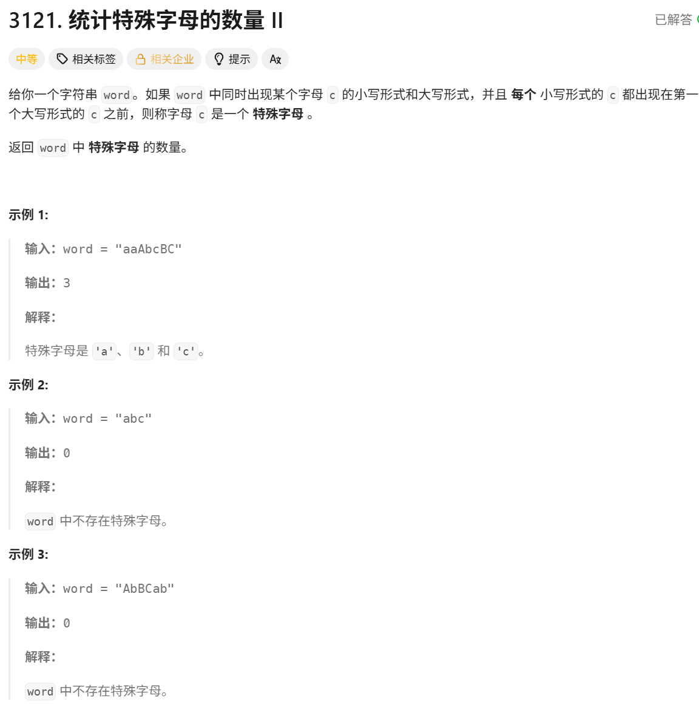

# 统计特殊字母的数量 II

> [!question] 题目描述
> 

---

> [!light] 核心思路
> **破局点**：本题比 I 多了顺序限制，某个字母要计入答案，必须先出现小写，再出现大写，并且之后不能再出现该字母的小写。
>
> 1. 用 `status[i]` 记录第 `i` 个字母的状态：`0` 未出现、`1` 已出现小写、`2` 已合法配对、`-1` 已作废。
> 2. 遇到小写字母时：
>    - 若状态为 `0`，改为 `1`；
>    - 若状态为 `2`，说明小写出现在大写之后，该字母作废，答案减一。
> 3. 遇到大写字母时：
>    - 若状态为 `1`，说明首次形成合法配对，状态改为 `2`，答案加一；
>    - 若状态为 `0`，说明大写先出现，不可能合法，状态改为 `-1`。
> 4. 状态为 `-1` 的字母后续不再参与统计。
> 5. 遍历结束后返回 `ans`。

---

> [!code] 代码实现
>
> ```cpp
> #include <bits/stdc++.h>
> using namespace std;
>
> /*
>  * @lc app=leetcode.cn id=3121 lang=cpp
>  *
>  * [3121] 统计特殊字母的数量 II
>  */
>
> // @lc code=start
> class Solution {
> public:
>     int numberOfSpecialChars(string word) {
>         // status[i] 记录字母 i 的状态：0=未出现, 1=仅有小写, 2=已配对成功, -1=非法作废
>         vector<int> status(26, 0);
>         int ans = 0;
>
>         for (char c : word) {
>             if (c >= 'a' && c <= 'z') {
>                 int idx = c - 'a';
>                 if (status[idx] == 0) {
>                     status[idx] = 1;
>                 } else if (status[idx] == 2) {
>                     status[idx] = -1;
>                     ans--;
>                 }
>             }
>             else if (c >= 'A' && c <= 'Z') {
>                 int idx = c - 'A';
>                 if (status[idx] == 1) {
>                     status[idx] = 2;
>                     ans++;
>                 } else if (status[idx] == 0) {
>                     status[idx] = -1;
>                 }
>             }
>         }
>
>         return ans;
>     }
> };
> // @lc code=end
> ```
