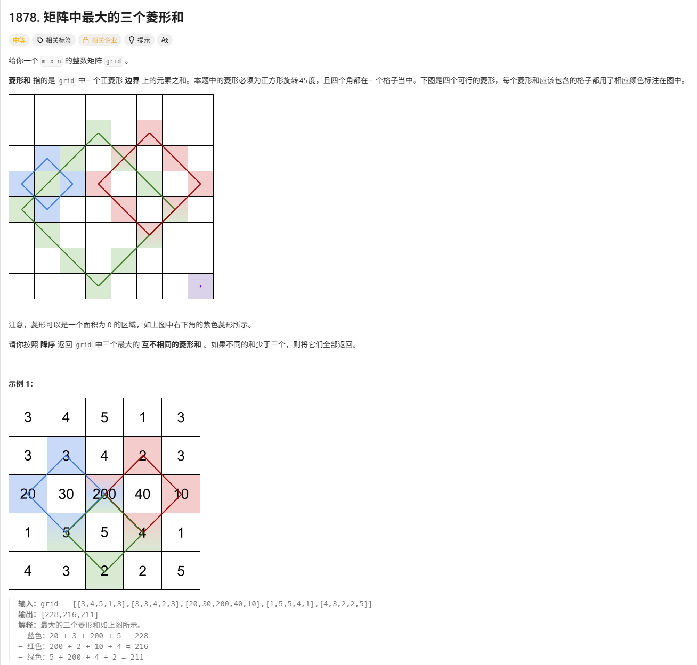

# 矩阵中最大的三个菱形和

> [!question] 题目描述
> 
>

---

> [!light] 核心思路
> **破局点**：枚举菱形中心点和边长，用set维护前三大值
>
> 1. 菱形最大边长由矩阵短边决定：`(min(n,m)+1)/2`
> 2. 枚举每个可能的中心点`[i][j]`和边长`edge`
> 3. 边长为1时只取中心点；否则累加四个顶点+四条边上的点
>
> **注意事项**：
>
> - 四个顶点需要单独计算，避免在边遍历时重复计算
> - 边遍历从`k=1`到`l-1`，跳过已经计算过的顶点位置

---

> [!code] 代码实现
> ```cpp
> class Solution {
> public:
>     vector<int> getBiggestThree(vector<vector<int>>& grid) {
>         int n = grid.size(), m = grid[0].size();
>         int Edge = (min(n, m) + 1) / 2;
>         set<int> s;
> 
>         for (int edge = 1; edge <= Edge; edge++)
>         {
>             int l = edge - 1;
>             for (int i = l; i < n - l; i++)
>             {
>                 for (int j = l; j < m - l; j++)
>                 {
>                     int sum = 0;
>                     if(l == 0) sum = grid[i][j];
>                     else {
>                         sum += grid[i - l][j];
>                         sum += grid[i + l][j];
>                         sum += grid[i][j - l];
>                         sum += grid[i][j + l];
>                         
>                         for (int k = 1; k < l; k++)
>                         {
>                             sum += grid[i - l + k][j + k];
>                             sum += grid[i + l - k][j + k];
>                             sum += grid[i + l - k][j - k];
>                             sum += grid[i - l + k][j - k];
>                         }
>                     }
>                     s.insert(sum);
>                     if (s.size() > 3)
>                     {
>                         s.erase(s.begin());
>                     }
>                 }
>             }
>         }
>         return vector<int>(s.rbegin(), s.rend());
>     }
> };
> ```
