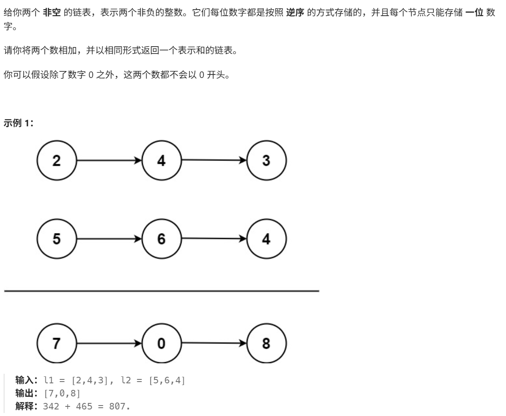

# 两数相加

> [!question] 题目描述
> 

---

> [!light] 核心思路
> **破局点**：按位模拟加法，维护一个进位 `carry`，同时遍历两条链表并构建结果链表。
>
> 1. 使用哑节点 `dummyHead` 统一处理头节点，`current` 指向结果链表尾部
> 2. 在循环中分别读取 `l1`、`l2` 当前位，不存在时按 `0` 处理
> 3. 当前位和为 `sum = carry + x + y`，新进位为 `sum / 10`
> 4. 当前结果位为 `sum % 10`，创建新节点接到结果链表尾部
> 5. 当 `l1`、`l2` 都遍历完但仍有进位时，需要继续补一个节点

---

> [!code] 代码实现
>
> ```cpp
> #include <bits/stdc++.h>
> 
> class Solution {
> public:
>     ListNode* addTwoNumbers(ListNode* l1, ListNode* l2) {
>         ListNode* dummyHead = new ListNode(0);
>         ListNode* current = dummyHead;
> 
>         int carry = 0;
> 
>         while (l1 != nullptr || l2 != nullptr || carry != 0) {
>             int x = (l1 != nullptr) ? l1->val : 0;
>             int y = (l2 != nullptr) ? l2->val : 0;
> 
>             int sum = carry + x + y;
>             carry = sum / 10;
> 
>             current->next = new ListNode(sum % 10);
>             current = current->next;
> 
>             if (l1 != nullptr) l1 = l1->next;
>             if (l2 != nullptr) l2 = l2->next;
>         }
> 
>         ListNode* result = dummyHead->next;
>         delete dummyHead;
>         return result;
>     }
> };
> ```
