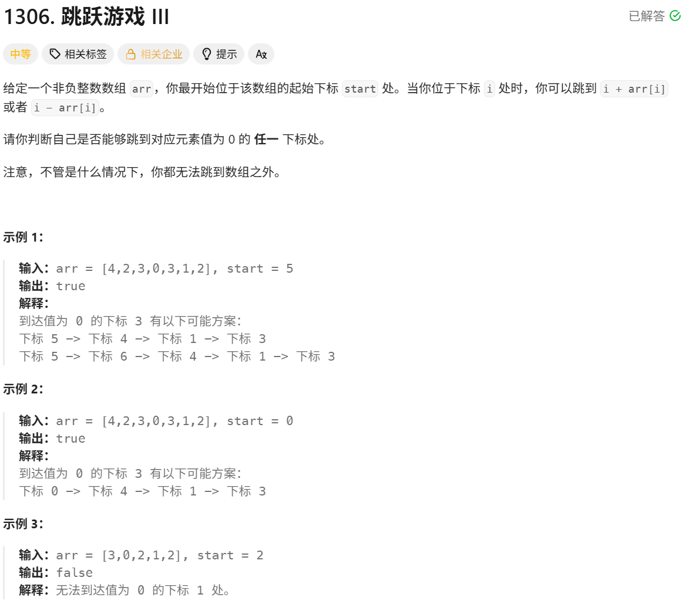

# 跳跃游戏 III

> [!question] 题目描述
> 

---

> [!light] 核心思路
> **破局点**：把每个下标看成图中的一个节点，从 `start` 出发，只要能到达任意值为 `0` 的节点就返回 `true`；为避免在环里无限跳，需要记录访问状态。
>
> 1. 使用 `visited` 数组记录某个下标是否已经访问过，防止重复搜索。
> 2. 递归函数 `jump(i)` 先判断越界和重复访问，这两种情况都返回 `false`。
> 3. 若 `arr[i] == 0`，说明已经到达目标位置，直接返回 `true`。
> 4. 标记当前下标已访问后，继续尝试两种跳法：`i + arr[i]` 与 `i - arr[i]`。
> 5. 只要任意一个方向可达 `0`，整体答案就是 `true`，否则为 `false`。

---

> [!code] 代码实现
>
> ```cpp
> #include <bits/stdc++.h>
> using namespace std;
>
> /*
>  * @lc app=leetcode.cn id=1306 lang=cpp
>  *
>  * [1306] 跳跃游戏 III
>  */
>
> // @lc code=start
> class Solution {
> public:
>     bool canReach(vector<int>& arr, int start) {
>         vector<bool> visited(arr.size(), false);
>         return jump(arr, start, visited);
>     }
>
>     bool jump(vector<int>& arr, int i, vector<bool>& visited) {
>         if (i < 0 || i >= arr.size()) {
>             return false;
>         }
>         
>         if (visited[i]) {
>             return false;
>         }
>         
>         if (arr[i] == 0) {
>             return true;
>         }
>
>         visited[i] = true;
>
>         return jump(arr, i + arr[i], visited) || jump(arr, i - arr[i], visited);
>     }
> };
> // @lc code=end
> ```
