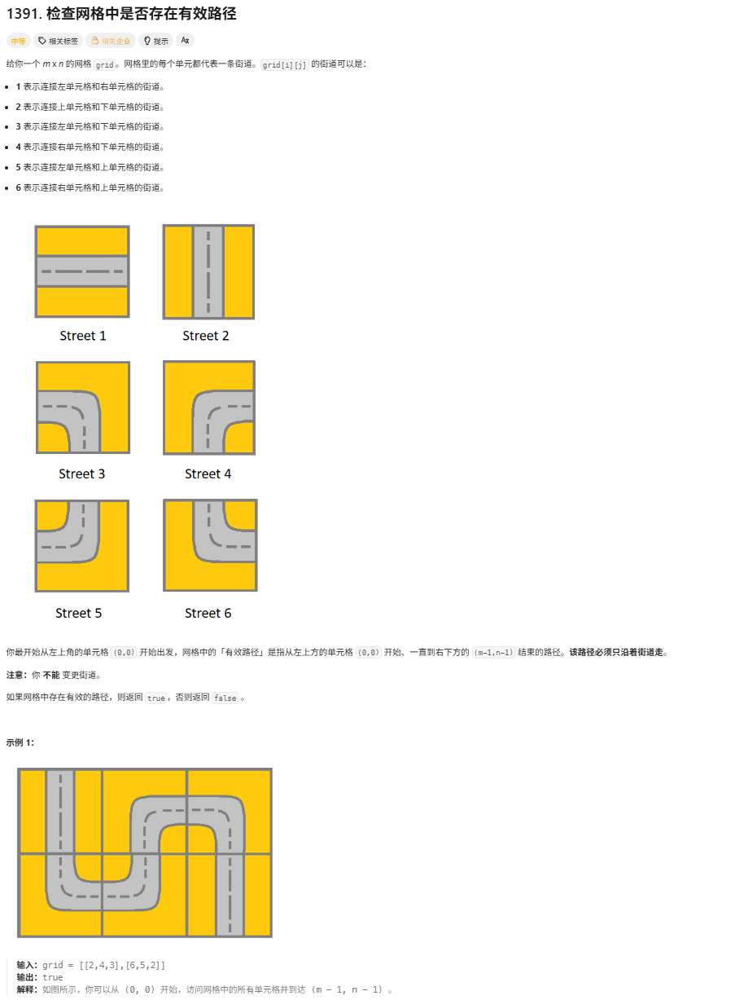

# 检查网格中是否存在有效路径

> [!question] 题目描述
> 

---

> [!light] 核心思路
> **破局点**：每种街道类型只允许沿固定方向连通；从起点 DFS 时，必须同时满足“当前格能走过去”和“下一个格能从反方向接回来”。
> 1. 预先定义方向数组 `dx/dy`，并为 1~6 每种街道类型建立可走方向表 `pipe`。
> 2. 从 `(0, 0)` 开始 DFS，访问过的格子标记为 `visited`，避免回头形成死循环。
> 3. 对当前格可走的每个方向，先判断下一个格是否越界或已访问；若合法则继续判断连通性。
> 4. 连通性判断方式是：设当前方向的反向为 `oppositeDir = (dir + 2) % 4`，若下一格类型包含该方向，说明两格可以拼接。
> 5. 只要有一条分支能到达右下角就返回 `true`；所有分支都失败则返回 `false`。

---

> [!code] 代码实现
>
> ```cpp
> #include <bits/stdc++.h>
> using namespace std;
>
> /*
>  * @lc app=leetcode.cn id=1391 lang=cpp
>  *
>  * [1391] 检查网格中是否存在有效路径
>  */
>
> // @lc code=start
> class Solution {
> public:
>     int dx[4] = {-1, 0, 1, 0};
>     int dy[4] = {0, 1, 0, -1};
>     vector<vector<int>> pipe = {
>         {},             // 0: 占位符
>         {1, 3},         // 1: 左右 -> 可向右(1)，向左(3)
>         {0, 2},         // 2: 上下 -> 可向上(0)，向下(2)
>         {2, 3},         // 3: 左下 -> 可向下(2)，向左(3)
>         {1, 2},         // 4: 右下 -> 可向右(1)，向下(2)
>         {0, 3},         // 5: 左上 -> 可向上(0)，向左(3)
>         {0, 1}          // 6: 右上 -> 可向上(0)，向右(1)
>     };
>     int m, n;
>
>     bool hasValidPath(vector<vector<int>>& grid) {
>         m = grid.size();
>         n = grid[0].size();
>         vector<vector<bool>> visited(m, vector<bool>(n, false));
>         
>         return dfs(grid, 0, 0, visited);
>     }
>
>     bool dfs(vector<vector<int>>& grid, int x, int y, vector<vector<bool>>& visited) {
>         m = grid.size();
>         n = grid[0].size();
>         
>         if (x == m - 1 && y == n - 1) {
>             return true;
>         }
>
>         visited[x][y] = true;
>         int currentType = grid[x][y];
>
>         for (int dir : pipe[currentType]) {
>             int nx = x + dx[dir];
>             int ny = y + dy[dir];
>
>             if (nx < 0 || nx >= m || ny < 0 || ny >= n || visited[nx][ny]) {
>                 continue;
>             }
>
>             // 获取下一个管道的类型
>             int nextType = grid[nx][ny];
>             
>             // 获取反方向
>             int oppositeDir = (dir + 2) % 4; 
>             
>             bool isConnected = false;
>             for (int nextDir : pipe[nextType]) {
>                 if (nextDir == oppositeDir) {
>                     isConnected = true;
>                     break;
>                 }
>             }
>             if (isConnected) {
>                 if (dfs(grid, nx, ny, visited)) {
>                     return true;
>                 }
>             }
>         }
>         
>         return false;
>     }
> };
> // @lc code=end
> ```
