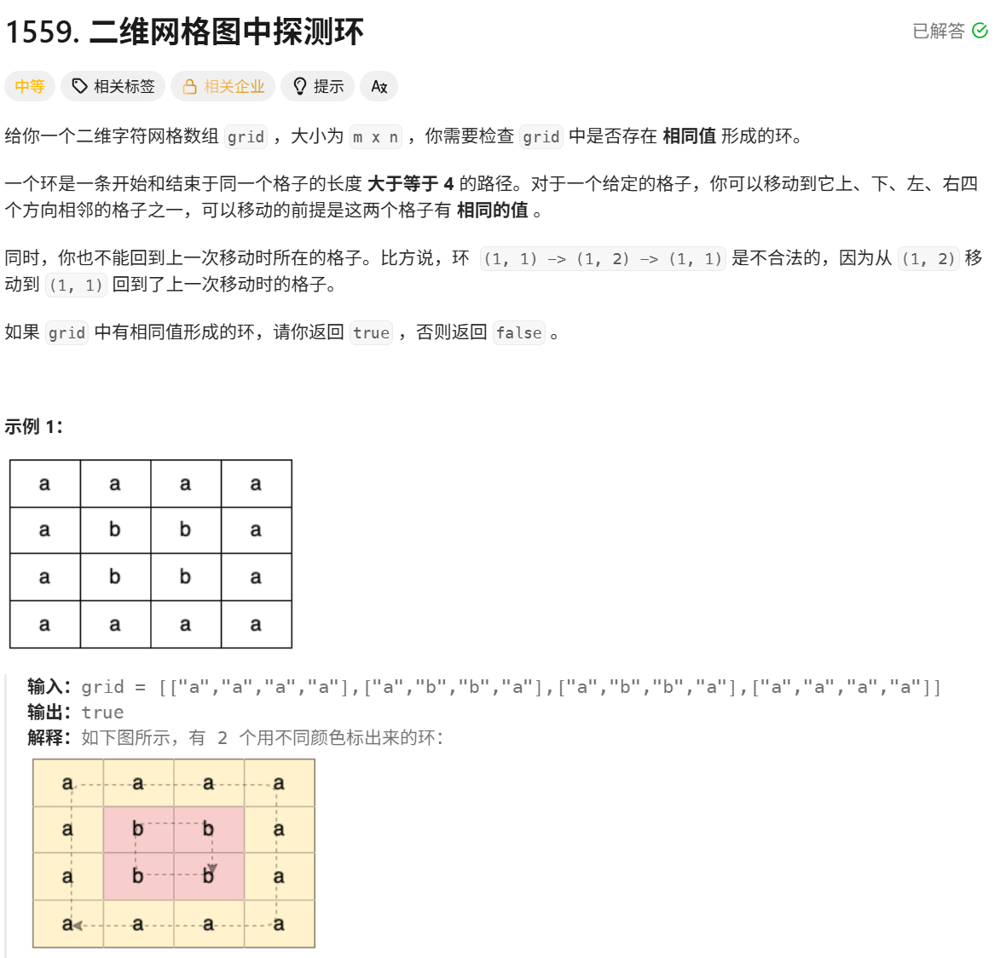

# 二维网格图中探测环

> [!question] 题目描述
> 

---

> [!light] 核心思路
> **破局点**：把每个格子看成图中的节点，对同字符连通块做 DFS；若访问到“已访问且不是父节点”的相邻格子，就找到环。
>
> 1. 遍历网格每个位置，遇到未访问格子就以它为起点做 DFS
> 2. DFS 只沿着“字符相同”的四联通方向扩展，并记录当前节点的父节点坐标
> 3. 若相邻同字符格子已经访问过，且不是父节点，说明存在回边，即存在环
> 4. 任意一次 DFS 找到环即可返回 `true`，全部遍历后仍未找到则返回 `false`

---

> [!code] 代码实现
>
> ```cpp
> #include <bits/stdc++.h>
> using namespace std;
>
> class Solution {
>     vector<vector<int>> dirs = {{-1, 0}, {1, 0}, {0, -1}, {0, 1}};
>
> public:
>     bool containsCycle(vector<vector<char>>& grid) {
>         int m = grid.size(), n = grid[0].size();
>         vector<vector<bool>> visited(m, vector<bool>(n, false));
>
>         for (int i = 0; i < m; ++i) {
>             for (int j = 0; j < n; ++j) {
>                 if (!visited[i][j]) {
>                     if (dfs(grid, i, j, visited, -1, -1)) {
>                         return true;
>                     }
>                 }
>             }
>         }
>         return false;
>     }
>
> private:
>     bool dfs(vector<vector<char>>& grid, int x, int y, vector<vector<bool>>& visited, int preX, int preY) {
>         visited[x][y] = true;
>
>         int m = grid.size(), n = grid[0].size();
>
>         for (auto& d : dirs) {
>             int nextX = x + d[0];
>             int nextY = y + d[1];
>
>             if (nextX >= 0 && nextX < m && nextY >= 0 && nextY < n) {
>                 if (grid[nextX][nextY] == grid[x][y]) {
>                     if (visited[nextX][nextY]) {
>                         if (nextX != preX || nextY != preY) {
>                             return true;
>                         }
>                     } else {
>                         if (dfs(grid, nextX, nextY, visited, x, y)) {
>                             return true;
>                         }
>                     }
>                 }
>             }
>         }
>         return false;
>     }
> };
> ```
