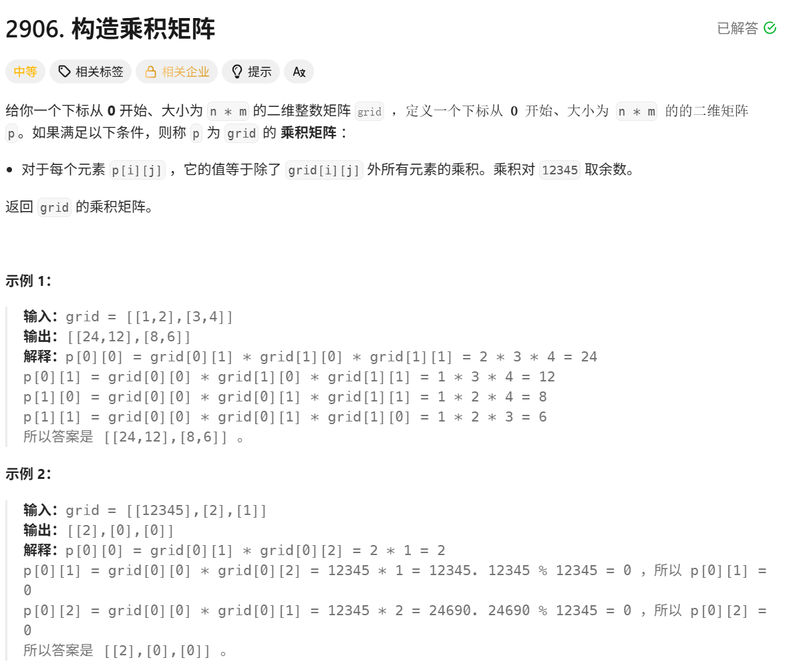

# 构造乘积矩阵

> [!question] 题目描述
> 
>

---

> [!light] 核心思路
> **破局点**：使用前缀乘积和后缀乘积来计算除当前元素外所有其他元素的乘积
>
> **关键注意点**：
>
> - 数据范围较大，不能直接模拟，否则超时
> - 对 12345 取余，且 12345=3×5×823 不是质数，不能简单计算总乘积再除以当前元素
> - 处理 0：如果矩阵中有一个 0，除了 0 那个位置，其他位置乘积为 0；如果有两个 0，所有位置全为 0（没有在代码中体现）
> - 取模限制：模运算中除法需要模逆元，但 m=12345 是合数，很多数没有逆元，除法逻辑会失效
>
> **解题思路**：
>
> 1. 将矩阵看作一个排好序的一维序列，从左到右，从上到下扫描
> 2. 对于任意位置，其"除自身外乘积" = (该位置之前所有元素的乘积) × (该位置之后所有元素的乘积)
> 3. 前缀乘积：存储在当前位置之前，按正向扫描顺序遇到的所有元素的乘积
> 4. 后缀乘积：存储在当前位置之后，按反向扫描顺序遇到的所有元素的乘积
> 5. 定义前缀乘积数组 pre[k] 表示前 k 个元素的乘积，后缀乘积数组 suf[k] 表示第 k 个元素之后所有元素的乘积
> 6. 最终结果：res[k] = (pre[k] × suf[k]) % 12345
> 7. 将一维结果重新填回 n×m 的矩阵中

---

> [!code] 代码实现

```cpp
# include <bits/stdc++.h>
using namespace std;
/*
 * @lc app=leetcode.cn id=2906 lang=cpp
 *
 * [2906] 构造乘积矩阵
 */

// @lc code=start
class Solution {
public:
    vector<vector<int>> constructProductMatrix(vector<vector<int>>& grid) {
        int m = grid.size(), n = grid[0].size();
        vector<vector<int>> p(m, vector<int>(n, 0));
        vector<vector<int>> pre(m, vector<int>(n, 1));
        vector<vector<int>> suf(m, vector<int>(n, 1));

        long long current_pre = 1; 
        for (int i = 0; i < m; ++i) {
            for (int j = 0; j < n; ++j) {
                pre[i][j] = current_pre; 
                current_pre = (current_pre * grid[i][j]) % 12345; 
            }
        }

        long long current_suf = 1;
        for (int i = m - 1; i >= 0; i--) {
            for (int j = n - 1; j >= 0; j--) {
                suf[i][j] = current_suf; 
                p[i][j] = (pre[i][j] * suf[i][j]) % 12345;
                current_suf = (current_suf * grid[i][j]) % 12345; 
            }
        }
        
        return p;
    }
};
// @lc code-end
```
