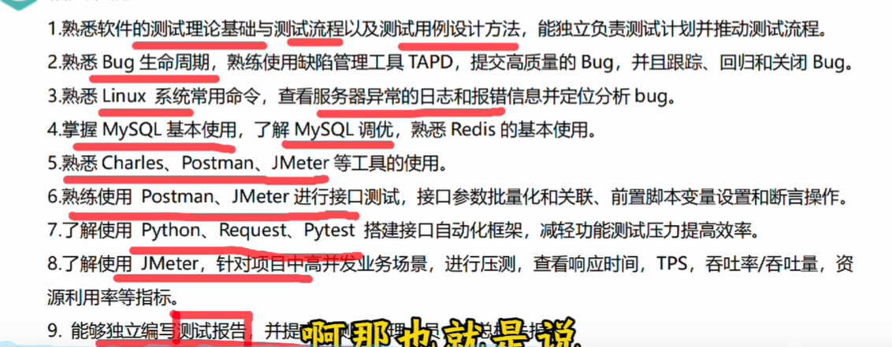
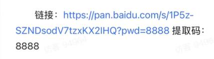

# 前后端学习指南

关于前后端的学习路线，分为两部分，一部分你只想打比赛，为一些项目写一些简单的后端做逻辑方面的处理，例外一部分是传统的的前后端，想靠着前后端之类的找工作。

## 简单的前后端

### 简短的前后端项目

前端便是基础的html

### 关于鸿蒙

除非你要打华为的创新赛，否则我不建议你碰。而且华为官方都出了卓易通的后门了。你不要说什么风口吗，我高三（2023年）一堆人喊着有前景，java的风口就火了五年，咋的了，他还能火10年？别说什么中美万一干起来之类的，万一干起来你的手机会立刻变成华为手机么？

## 前后端工作
## 之后

### 软件测试

工欲善其事，必先利其器。软件测试工具非常多，通常会根据**测试维度**（如UI、接口、性能）以及**测试阶段**来进行分类选择。

以下是当前行业内最主流、最实用的软件测试工具盘点：

## 1. UI 自动化测试工具（前端/业务层）

这类工具主要模拟真实用户在浏览器或手机 App 上的点击、输入等操作，非常适合做业务主流程的**回归测试**。

- **Playwright (强烈推荐)：** 微软开源的新一代端到端测试工具。支持多语言（Python, JS, Go 等），速度极快，自带自动等待机制（不易因页面加载慢而报错），且录制脚本功能非常强大，正在迅速取代 Selenium。
    
- **Selenium：** 行业老牌常青树，生态极其庞大，支持几乎所有浏览器，但配置相对繁琐，维护成本较高。
    
- **Appium：** 移动端（iOS/Android）自动化测试的绝对霸主，跨平台且支持多种编程语言。
    

## 2. 接口（API）测试工具

接口测试性价比较高，因为它避开了复杂的前端 UI，直接校验后端逻辑和数据交互。

- **Postman：** 几乎人手必备的 API 调试与测试工具。支持编写测试脚本（JavaScript）、配置环境变量、一键运行测试集（Collection），日常抓包调试非常方便。
- **Apifox / YApi：** 国内非常流行的接口管理工具，将 API 文档、调试、Mock 数据、自动化测试融为一体，团队协作体验很好。
- **Requests (Python) / RestAssured (Java)：** 如果纯写代码做接口自动化，这两个代码库分别是 Python 和 Java 领域的首选。

xmind
jmeter
charles

## 3. 性能 / 压力测试工具

用于测试系统在高并发、大数据量情况下的稳定性和响应速度。

- **JMeter：** Apache 旗下的开源压测工具，基于 Java。可以通过图形界面配置复杂的压测场景，支持接口、数据库、FTP 等多种协议，是目前应用最广的压测工具。
    
- **Locust：** 基于 Python 的开源压测框架。它的核心特点是“代码定义用户行为”，并发机制基于协程（Gevent），单机能扛住更高的并发量，对开发者非常友好。
    

## 4. 单元测试框架（代码层）

开发人员和测试开发必备，用于验证函数、类或单一模块的正确性。

- **Python 生态：** `pytest`（目前最流行，插件丰富、语法简洁）、`unittest`（自带标准库）。
    
- **Java 生态：** `JUnit 5`、`TestNG`（更适合集成测试）。
    
- **前端生态：** `Jest`、`Vitest`（速度极快，适配 Vite 项目）。
    

## 5. 持续集成与测试管理（CI/CD）

测试工具只有融入到研发流水线中，才能发挥最大的回归测试价值。

- **Jenkins：** 老牌开源自动化服务器，插件多到无法想象，几乎能对接所有测试工具。
    
- **GitHub Actions / GitLab CI：** 现代研发团队更青睐的内置 CI/CD 工具，直接通过 YAML 配置文件在代码仓库中跑自动化测试。
    
- **Jira / PingCode / ZenTao（禅道）：** 用于管理测试用例、提 Bug、跟踪缺陷生命周期的管理平台。
    

## 💡 选型建议

> - **如果你是刚接触自动化的新手：** 推荐尝试 **Postman（接口）** + **Playwright（UI录制）**，上手最快，反馈最直观。
>     
> - **如果你追求高效率的代码级测试：** 推荐 **Python + pytest + Playwright/Requests** 的组合，开发速度极快。
>     

你目前正在推进哪个方向的测试？如果是针对具体的项目，我可以帮你规划一套工具组合拳。

很多公司没搞过，也以为 Agent 做起来很简单，从上到下都觉得很简单就容易寄，等到不符合期望的时候，一般都碰壁很多次了

我建议你直接从实践开始，这几个路径

1. 读 Anthropic 的 Blog，其中写的很详细
2. 看一下 LangChain 和 LangGraph 的设计，熟悉概念
3. 翻一下 pi agent 这种实现，看看组织和设计
4. 翻 Claude Code 3 月泄漏出来的源代码，生产级 Agent 参考
5. 随便做个你有兴趣搞的 Agent 发上线，想不到路子的话，看社区其他佬搞的东西找找灵感

