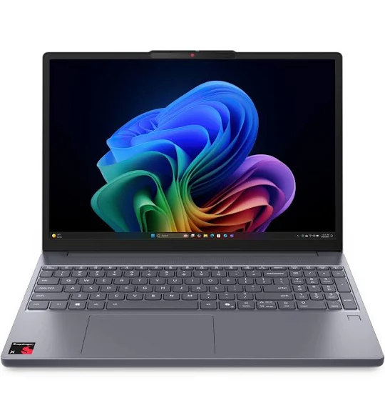

# 认识计算机（基础）——如何购买计算机

## 前言

暑假快到了，相信很多准大学生们迫不及待的想要有一台属于自己的电脑了。但是正是这第一次让很多人犯了难。加上有很多毒攻略说暑假不要买，暑假收割大学生，等双11；双11不让买，双11收割大学生等双12，还有年货节……一年到头天天都有人劝你“等一等”，最后等到大二还没买上。所以就有了这篇文章，今天我们就把买电脑这件事一次性说透，不当“等等党”，也不当“冤大头”。

## 要买什么电脑

大家买水果都要分西瓜的种类（比如麒麟瓜、美都瓜、特小凤），所以我们也把电脑分成以下几类：

- **系统**：Windows、macOS
    
- **形态（是否方便携带）**：笔记本轻薄本、游戏本、台式机
    

## 系统

什么是系统？简单来说，系统就是电脑的“大管家”和“翻译官”。

拿手机举例子，你的手机不是有屏幕和你的摄像头，屏幕为什么可以显示你摄像头拍出来的画面，这中间是不是需要一个“人”来传话？——“来，给我在屏幕上显示一棵小树！”

但是传话使用中文、英文还是日文？所以就有了不同的系统（品种）。
在手机上这个系统可以是安卓，在电脑上这个系统就可以是windows和Macos；
### 1. macOS 系统：精品店里的“高档哈密瓜”

- **特点**：苹果电脑专属。界面精致，系统像丝绸一样顺滑，几乎没有流氓广告，和 iPhone 联动极佳，屏幕素质和续航都是顶级。
- **缺点**：
	- **价格**：同性能的情况下，macOS的价格会比windows规格一两千，不要问为什么，就是贵。
	- **几乎是游戏荒漠**市面上 $95\%$ 的大型游戏（如《永劫无间》、《黑神话》）它都玩不了。甚至连原神都玩不了。

这里就有人说了，“哎，我就是爱学习，不玩游戏”。那么接下来的情况可能会让你为难了。
那就是兼容性问题
你们后面在上专业可得时候老师也许会给你一些软件，但是这些软件大部分都是不支持macos，而是支持接下来要将的windows的，那么阁下又要如何应对？

### 2. Windows 系统：百果园里的“大众大西瓜”

- **特点**：吃的人最多，兼容性无敌。世界上绝大多数的软件、游戏、学校里奇奇怪怪的考试插件，都是优先给 Windows 开发的。
    
- **缺点**：现在windows电脑的评价远不如几年前，原因是现在的windows版本是windows11，几年前的大部分电脑是windows10。相比于两者之间一些小的，因人而异的操作习惯上的不同，windows11最让人诟病的地方就是windows11的强制更新，他会带来什么结果？就是你前面还好好可以打的游戏突然就不能完了，虽然这种可能性很低但是也并不是完全没有可能发生。

## 系统总结

如果这是你人生中的第一台电脑，无脑选择windows电脑就行了，直接给macos系统的电脑判个死刑。
但是稍微提醒一下，有些专业（美术设计）可能会要求你是macos因为很多设计软件是苹果专有的，不过这种情况下在你领取到录取通知书的时候你们的老师应该就会拉群通知你们了。

## 现在市面上的主流（2026年最新避坑指南）

买电脑不能只看系统，还要看它具体是什么“形态”。结合当下的主流，我们来盘一盘：

### 1. 轻薄本：

顾名思义他的最大优势就是轻
- **主流现状**：现在的轻薄本普遍换上了“AI 芯片”。拥有不错的**续航**，充满电能在图书馆撑一整天，而且重量只有 $1.2\text{kg}$ 左右，薄得像杂志。
- **大实话**：适合不玩大型游戏、需要天天背着电脑去上课打卡的人。

### 2. 游戏本：
不要被他的名字欺骗，他不是只能用来打游戏的机器。什么渲染建模样样精通。
- **大实话**：性能是拉满了，但是它又厚又重（加上像砖头一样的充电器普遍超过 $3\text{kg}$ ），不插电只能活 2 小时，风扇转起来像直升机起飞，噪音相对来说不小，可能男生宿舍冲突的罪魁祸首。

### 3. 台式机：

- **大实话**：完全没法带出门。只要宿舍/家里不限电、有桌子，它是性价比最高的选择

## 什么时候买（打破毒攻略的谣言）

那些教你“从暑假等到年货节”的攻略，纯粹是让你陷入精神内耗。其实，电脑行业有其固定的促销规律，只要抓住以下两个核心时间点，你就绝不会被当成“韭菜”割：

### 1. 618 大促 / 暑期教育优惠（6月 - 8月）—— **准大学生的最佳黄金期**

- **为什么适合买**：
    
    - **大厂直降**：每年 5、6 月份各大品牌刚好发布完一轮新电脑，618 会直接迎来第一波大降价。
        
    - **教育优惠**：7、8 月份是苹果（Apple）等大厂的“返校季”（Back to School）活动。凭借大学录取通知书，买 Mac 不仅能打折，往往还**免费送耳机或 Apple Pencil**。
        
    - **早买早享受**：暑假把电脑买回家，有长达两个月的时间去熟悉系统、装好软件。总比开学手忙脚乱，或者双11看着别人用电脑、自己只能干等要强得多。
        

### 2. 双11大促（10月 - 11月）—— **等等党的终点站**

- **为什么适合买**：全网电商大混战，各类消费券、满减券叠满，确实能拿到全年的“历史低价”。
    
- **代价是什么**：你要多忍受两个月没有电脑的日子。开学前两个月各种加社团、做 PPT、交作业，没有电脑会非常痛苦。为了省下几百块，牺牲开学初期的体验，并不划算。
    

> **购买金句**：**刚需（马上要用）就暑假买，不急用（有备用机）就等双11。** 至于双12和年货节，基本都是双11的清库存余热，没必要特意去等。

## 如果你是……（教你如何对号入座）

买电脑最忌讳“创造需求”。别为了“可能要剪视频”去买大万块的专业本，也别为了“可能要玩游戏”背着死沉的游戏本去上课。根据你的专业和需求，直接对号入座：

### 👨‍💻 计算机 / 软件工程 / 大数据专业

- **建议**：**Windows 游戏本** 或 **台式机**（预算充足且不玩游戏可考虑 **MacBook Pro 16G内存起步**）。
    
- **原因**：写代码、跑虚拟机、编译大型项目非常吃 CPU 和内存。Windows 兼容性最好，能省去很多配环境的麻烦；Mac 适合特定开发，但千万别买 8G 内存的丐版。
    

### 🎨 设技 / 动画 / 视频剪辑专业

- **建议**：**高色域的 Windows 游戏本** 或 **MacBook Pro**。
    
- **原因**：你们的专业是“吃性能大户”。渲染 3D、剪辑 4K 视频需要强悍的独立显卡。同时屏幕色彩一定要准（认准 $100\%\text{ sRGB}$ 或调色更准的 Mac 屏幕），否则设计出来的作品会有严重色差。
    

### ⚖️ 法学 / 文学 / 经济管理 / 外语专业

- **建议**：**Windows 轻薄本** 或 **MacBook Air**。
    
- **原因**：你们日常最大的需求是码字、查文献、做 PPT、背着去图书馆。高续航、轻便、高颜值的轻薄本是绝对的首选，千万别买重得像砖头的游戏本。
    

### 🎮 纯粹的硬核游戏玩家（不限专业）

- **建议**：**Windows 游戏本** 或 **DIY台式机**（直接对 macOS 说再见）。
    
- **原因**：游戏玩家唯一的信仰就是帧率和画质。Windows 配合强大的独立显卡，才是你畅玩 3A 大作的唯一通行证。