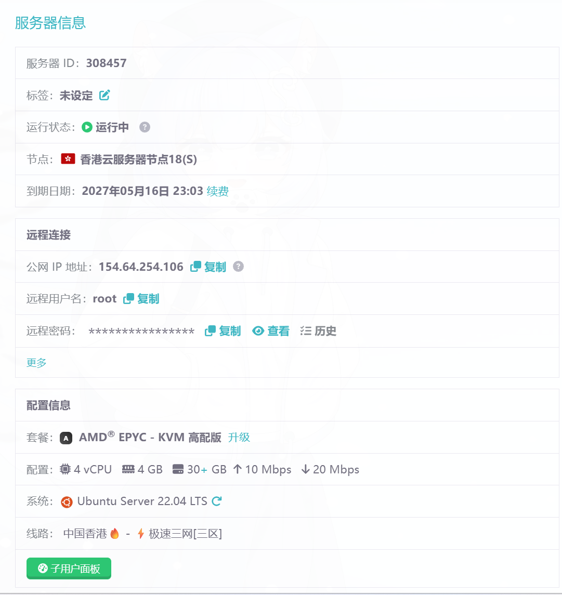
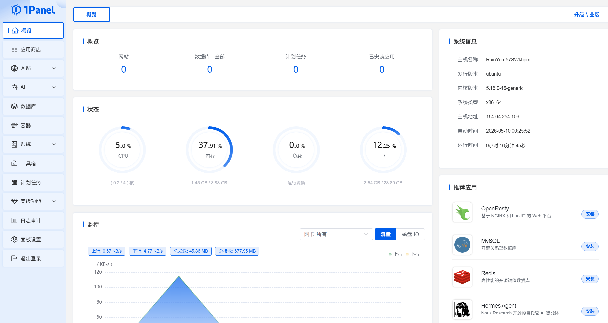
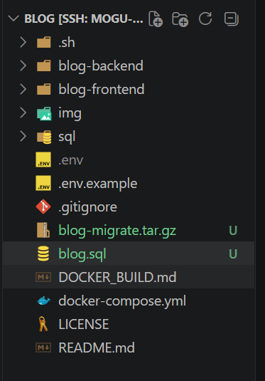

# 记录一下服务器的迁移

## 迁移前的准备

### 服务器采购


### 安装1panel

使用1panel的原因是因为我的项目使用docker进行的部署，再加上相对来说1panel比较省系统资源。新手任然建议使用宝塔，因为教程相对来收较多。

```bash
curl -sSL https://resource.fit2cloud.com/1panel/package/quick_start.sh -o quick_start.sh && sudo bash quick_start.sh
%% 执行后的交互步骤 %%
%% 
1. **选择语言**：按需选择（通常选中文）
2. **设置安装目录**：直接回车使用默认 `/opt` 即可
3. **确认安装 Docker**：输入 `y` 同意（1Panel 依赖 Docker）[](https://openkits-wiki.easyeda.com/zh-hans/tspi-3-rk3576/one-panel/one-panel-install.html)
4. **配置镜像加速**：输入 `y` 同意（提升国内下载速度）
5. **设置访问端口**：直接回车随机生成，或手动输入（如 `18061`）
6. **设置安全入口**：直接回车随机生成（一串字符，增加安全性）
7. **设置用户名和密码**：可自定义，也可回车随机生成 
%%
```




## 迁移服务器

### 导出原服务器的数据

```bash
mysqldump -h127.0.0.1 -P3306 -uroot -p \
  --single-transaction --routines --triggers --events blog > blog.sql

root@hcss-ecs-077f:/www/wwwroot/Blog# docker volume ls | grep -i minio
%% 得到挂载卷的名字 %%
local     blog_minio_data

docker run --rm -v blog_minio_data:/from -v $(pwd):/to alpine sh -c "cd /from && tar czf /to/minio_data.tar.gz ."

%% 打包发送 %%
scp minio_data.tar.gz blog.sql root@154.64.254.106:/srv/blog/
```


### 创建拥有root权限的root用户

应为ubunt在SSH 的默认配置文件有一项设置叫做 `PermitRootLogin`，所以不用担心其他人使用root远程登录，即使是你自己也做不到。
所有我们需要创建一个用于远程连接的用户
```bash
useradd -m -G sudo -s /bin/bash 用户名
passwd 用户名
```


## 配置途中的问题

