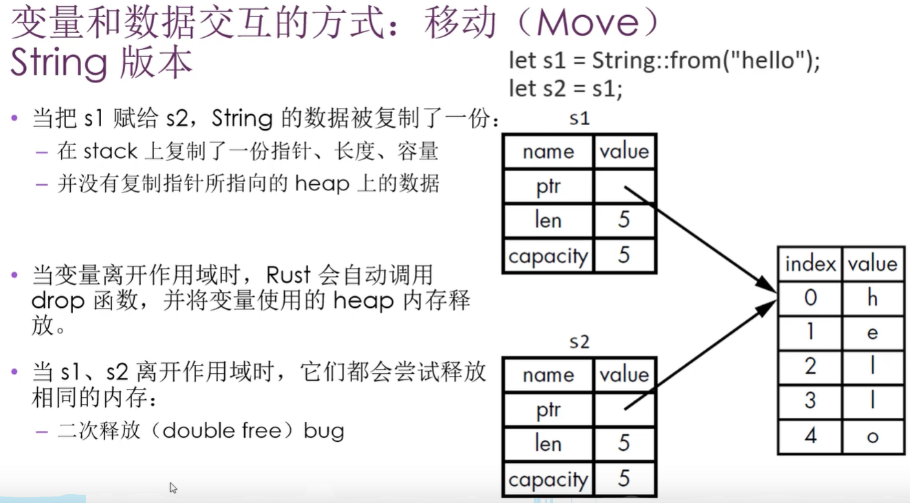
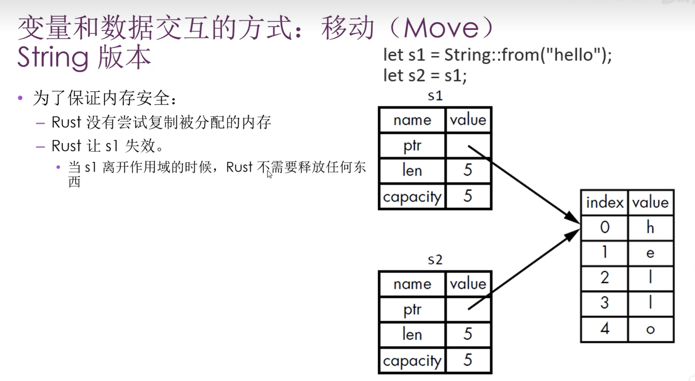

# 所有权

## 栈内存 & 堆内存

在 Rust 中，一个值是在栈上还是在堆上，会影响程序的性能和行为。

### 栈内存（Stack）

- 按值被压入的顺序存储，按相反的顺序将它们移除（先进后出，LIFO）
  - 添加数据：压栈（push）
  - 移除数据：出栈（pop）
- **所有存储在栈上的数据大小在编译时必须是已知的（固定大小）**
- 因为**指针**是固定大小，所以可以将指针放在stack上。

- 把值压到栈上通常不叫"分配"

- 因为数据大小固定、位置连续，CPU 只需要移动指针，所以把数据放到栈上的**速度非常快**

### 堆内存（Heap）

- 当你把数据放入堆时，需要向操作系统申请一块足够大的空间（这个过程称之为**分配**）
  - 操作系统在堆里找到一块足够大的空闲区域
  - 把这块区域标记为"已使用"
  - 返回一个指向这块内存的指针（地址）

### 栈 vs 堆：何时使用

| 使用栈 | 使用堆 |
|--------|--------|
| 大小在编译期已知 | 大小在编译期未知或可变 |
| 生命周期与函数调用绑定 | 需要跨函数、跨作用域存活 |
| 固定大小的值类型 | 动态大小的数据 |
| **典型**：`i32`、`bool`、`char`、小元组、数组 | **典型**：`String`、`Vec<T>`、`Box<T>` |
| 访问快，无分配开销 | 访问需通过指针，有分配/释放开销 |

- **优先栈**：能用栈就用栈，性能更好
- **必须堆**：数据大小运行时才确定（如用户输入字符串）、或需要在多处共享时，才用堆

### 函数调用

- 每次调用函数时，Rust 会在栈上为这次调用开辟一个**栈帧（stack frame）**
  - 栈帧里通常包含：参数、局部变量、返回地址等
  - 函数结束时，这个栈帧整体从栈顶弹出，对应的栈上数据就一起被回收
- 所以：
  - **函数参数（实参）**（按值传递的、大小在编译期已知）通常存放在栈上
  - **局部变量（形参）**如果是固定大小的值类型（比如 `i32`、`bool`、元组等），也通常在栈上

## 所有权

### 什么是所有权

**所有权（Ownership）** 是 Rust 最核心的特性，用于在**编译期**保证内存安全，无需垃圾回收，也无需手动释放。

### 内存管理的三种方式

- 程序在运行时都必须管理它们使用计算机内存的方式
  - **垃圾回收（GC）**：运行时自动追踪并回收不再使用的内存（如 Java、Go）
  - **手动管理**：程序员显式分配和释放内存（如 C、C++），易出错（内存泄漏、双重释放、悬垂指针）
  - **所有权系统**：Rust 在编译期通过规则检查，确保内存安全

### 所有权存在的原因

- 跟踪代码哪些部分正在使用堆上的数据
- 最小化heap上重复的数据量
- 清理heap上未使用的数据避免不必要的内存分配和释放

### 所有权的核心规则

1. **每个值有且仅有一个所有者**：值绑定到变量后，该变量就是其唯一所有者
2. **所有者离开作用域时，值被丢弃**：自动调用 `drop` 清理（如释放堆内存）
3. **赋值或传参会转移所有权**：原变量不再有效，避免同一块内存被多处使用

### string与所有权

#### string类型的简单介绍

在 Rust 语言中，“字符串”这个概念被拆分成了两种完全不同的形式处理。

- 字符串字面量（&str）
	- 它通常被硬编码在编译后的**二进制文件**中
	- 一旦写死在代码里，程序运行期间它的内容和长度就定死了
- string类型（string）
	- 在 **heap（堆）** 上分配空间
	- 程序运行的时候（Runtime）动态创建
	- 用完String之后，需要将内存返回给操作系统
		- **drop**：Rust 在值**离开作用域**时自动调用的清理逻辑
			- 由 `Drop` trait 定义，`String`、`Vec` 等类型已实现
			- `String` 的 `drop` 会释放其在堆上分配的内存
			- 一般无需手动调用；若需提前释放，可用 `std::mem::drop(value)` 显式传入所有权

```rust
fn main() {
    let mut s = String::from("hellp");
    //  :: 表示from是string类型下的函数
    s.push_str(" world");
	    println!("{}", s);
}
```

#### 变量与数据的交互

- 在 Rust 中，变量与数据交互的方式有四种：
  - 移动（Move）
  - 复制（Copy）
  - 克隆（Clone）
  - 引用（Reference）

##### 移动（Move）

- 移动是指将一个变量的所有权转移给另一个变量
- 移动后，原来的变量将不再有效

```rust
let s1 = String::from("hello");
let s2 = s1;
// println!("s1: {}", s1);  // 编译错误！s1 已被移动，不再有效
println!("s2: {}", s2);     // 只有 s2 有效，输出: hello
```

- 上述代码中，若取消注释 `println!("s1: {}", s1)`，会**编译失败**，因为 `s1` 在 `let s2 = s1` 时所有权已转移给 `s2`，`s1` 不再有效

**原因**： 可能会导致二次释放



**解决方案**



#### 复制（Copy）

- 复制是指将一个变量的值复制给另一个变量
- 复制后，原来的变量将不再有效

```rust
let x = 5;
let y = x;
println!("x: {}", x);  // x 仍然有效
println!("y: {}", y);  // y 拥有一份副本
```

- **Copy  trait**：实现了 `Copy` 的类型在赋值时会**自动拷贝**，不会发生移动
- 拷贝后**原变量仍然有效**，因为值被复制了一份，双方各自拥有一份独立数据
- 常见实现 Copy 的类型：
  - 标量类型：`i8`~`i128`、`u8`~`u128`、`f32`、`f64`、`bool`、`char`
  - 仅包含 Copy 类型的元组，如 `(i32, bool)`、`(char, i32)`
- **为何基本类型用 Copy**：固定大小、在栈上，拷贝成本低；`String` 等堆上类型未实现 Copy，赋值时发生移动

##### 克隆（Clone）

- 对于堆上类型（如 `String`），使用 `.clone()` 会复制一份独立的数据，原变量和新变量各自拥有自己的数据
- 克隆后，**原变量仍然有效**，两个变量可同时使用

```rust
let s1 = String::from("hello");
let s2 = s1.clone();
println!("s1: {}", s1);  // s1 仍然有效
println!("s2: {}", s2);  // s2 拥有独立副本
```

- 输出结果为：
  - s1: hello
  - s2: hello

##### 引用（Reference）

- 引用（借用）是指创建一个指向原数据的指针，**不转移所有权**
- 引用后，**原变量仍然有效**，可同时使用原变量和引用

```rust
let s1 = String::from("hello");
let s2 = &s1;
println!("s1: {}", s1);
println!("s2: {}", s2);
```

- 输出结果为：
  - s1: hello
  - s2: hello

- `s2` 是 `s1` 的引用（借用），`s1` 仍拥有数据，两者可同时使用