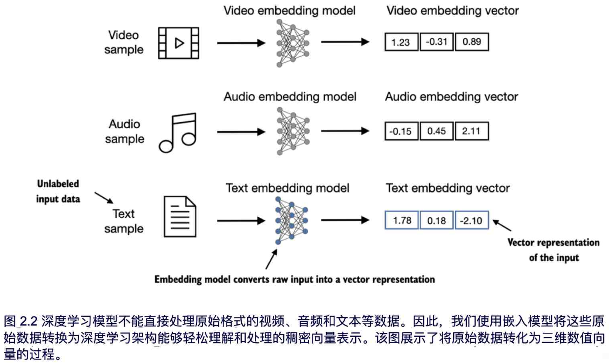

# 处理文本数据

在**预训练**阶段，LLM 逐字处理文本。通过**预测下一个单词任务**，来训练出拥有数百万到数十亿参数的 LLM，最终生成的模型具有出色的能力。随后可以进一步微调模型，以遵循指令或执行特定目标任务。

在本章中，您将学习如何为训练 LLM 准备输入文本。这包括将文本拆分为单个单词和子词token，并将这些token编码为 LLM 的向量表示。您还将了解一些先进的token分割方案，比如字节对编码，流行 LLM 中常用此类优化后的方案。最后，我们将实现一个采样和数据加载策略，以生成后续章节中训练 LLM 所需的输入输出数据对。

## 理解此嵌入

深度神经网络模型，包括 LLM，往往无法直接处理原始文本。这是因为文本是离散的分类数据，它与实现和训练神经网络所需的数学运算不兼容。因此，我们需要一种方法将单词表示为连续值向量。
将数据转换为向量格式的过程通常被称为**嵌入**（Embedding）。我们可以通过**特定的神经网络层**或其**他预训练的神经网络模型**来对不同类型的数据进行嵌入。

针对性的方法将这些不同的数据类型转换为适合神经网络处理的向量表示。

| 数据类型 |     数据特征      |               嵌入模型               |     主要特征      |
| :--: | :-----------: | :------------------------------: | :-----------: |
|  文本  | 离散的、序列化的符号数据  |   Word2Vec, GloVe, BERT, GPT 等   |  语义关系、上下文理解   |
|  图像  | 二维像素网格，具有空间特征 |       CNN（ResNet、VGG）、ViT        | 形状、纹理、颜色等视觉特征 |
|  音频  |    一维时序信号     |     CNN+频谱图、RNN、Transformer      |  频率、音调、时序依赖   |
|  视频  |    时空序列数据     | 3D CNN、RNN+CNN、Video Transformer |   时空特征、动作捕捉   |
嵌入的本质是将离散对象（如单词、图像或整个文档）映射到连续向量空间中的点。嵌入的主要目的是将非数值数据转换为神经网络能够处理的格式

单词嵌入是最常用的文本嵌入形式，但也存在句子、段落或整篇文档的嵌入。句子和段落嵌入常被用于检索增强生成技术。