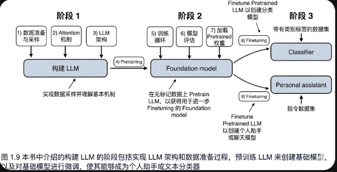

# 处理文本数据

在**预训练**阶段，LLM 逐字处理文本。通过**预测下一个单词任务**，来训练出拥有数百万到数十亿参数的 LLM，最终生成的模型具有出色的能力。随后可以进一步微调模型，以遵循指令或执行特定目标任务。

在本章中，您将学习如何为训练 LLM 准备输入文本。这包括将文本拆分为单个单词和子词token，并将这些token编码为 LLM 的向量表示。您还将了解一些先进的token分割方案，比如字节对编码，流行 LLM 中常用此类优化后的方案。最后，我们将实现一个采样和数据加载策略，以生成后续章节中训练 LLM 所需的输入输出数据对。

## 理解此嵌入

深度神经网络模型，包括 LLM，往往无法直接处理原始文本。这是因为文本是离散的分类数据，它与实现和训练神经网络所需的数学运算不兼容。因此，我们需要一种方法将单词表示为连续值向量