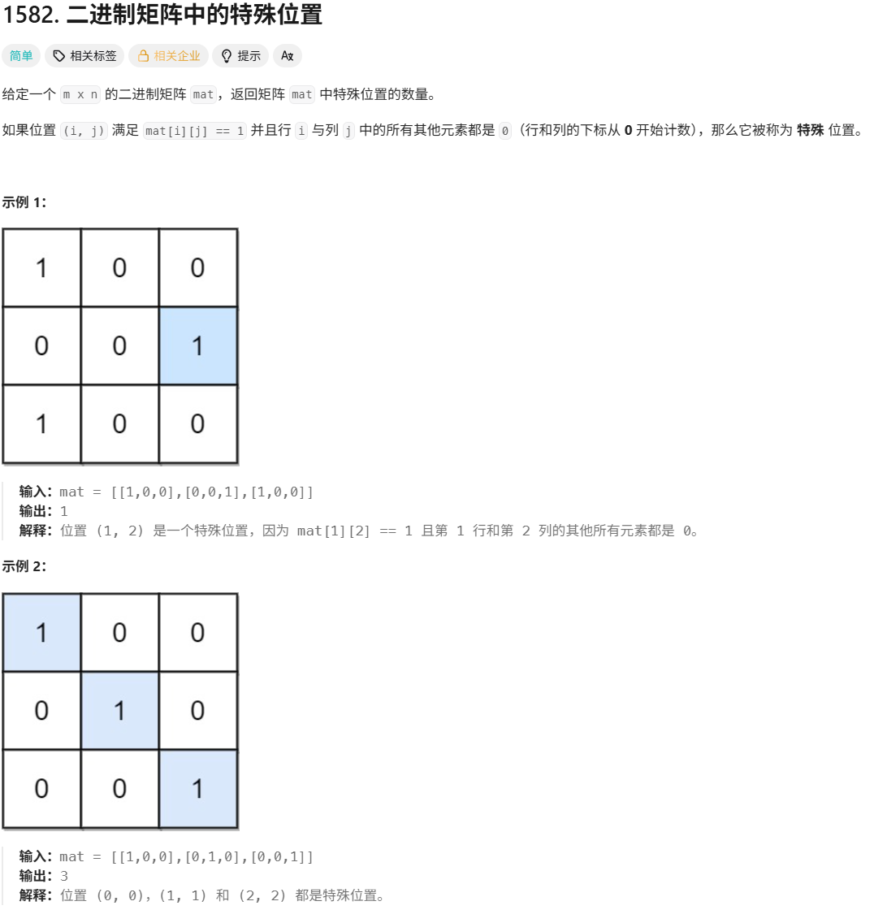

# 二进制矩阵中的特殊位置

> [!question] 题目描述
> 
>
>---

<br>

> [!light] 核心思路
> **破局点**：使用 **暴力枚举** 检查每个位置是否为特殊位置。
>
> 1. 遍历矩阵中的每个位置
> 2. 对于值为 1 的位置，检查其所在行和列是否只有这一个 1
> 3. 如果满足条件，计数器加 1

<br>

> [!code] 代码实现
> ```cpp
> class Solution {
> public:
>     int numSpecial(vector<vector<int>>& mat) {
>         int ans = 0;
>         for (int i = 0; i < mat.size(); i++)
>         {
>             for (int j = 0; j < mat[0].size(); j++)
>             {
>                 if (mat[i][j] == 1){
>                     if (check(mat, i, j))
>                         ans++;
>                 }
>             }
>         }
>         return ans;
>     }
> 
>     bool check(vector<vector<int>>& mat, int x, int y){
>         for (int i = 0; i < mat.size(); i++)
>         {
>             if (i != x && mat[i][y] == 1)
>                 return false;
>         }
>         for (int j = 0; j < mat[0].size(); j++)
>         {
>             if (j != y && mat[x][j] == 1)
>                 return false;
>         }
>         return true;
>     }
> };
> ```
