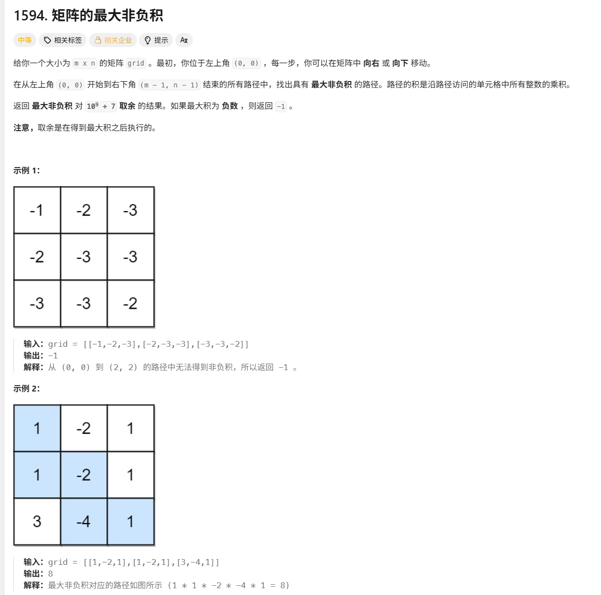

# 矩阵的最大非负积

> [!question] 题目描述
> 
>

---

> [!light] 核心思路
> **破局点**：使用动态规划，同时记录每个位置的最大值和最小值
>
> 1. 定义dp[i][j]为到达位置(i,j)时的最大值和最小值
> 2. 初始化第一行和第一列
> 3. 对于每个位置，根据当前值的正负选择使用前驱位置的最大值或最小值
> 4. 最终结果为右下角的最大值，若为负则返回-1

---

> [!code] 代码实现

```cpp
# include <bits/stdc++.h>
using namespace std;
/*
 * @lc app=leetcode.cn id=1594 lang=cpp
 *
 * [1594] 矩阵的最大非负积
 */

// @lc code=start
class Solution {
    vector<vector<pair<long long, long long>>> memu;
    int m, n;
public:
    int maxProductPath(vector<vector<int>>& grid) {
        m = grid.size();
        n = grid[0].size();
        memu = vector<vector<pair<long long, long long>>>(m, vector<pair<long long, long long>>(n, {0, 0}));

        memu[0][0].first = memu[0][0].second = grid[0][0];
        for(int i = 1; i < m; ++i){
            memu[i][0].first = memu[i - 1][0].first * grid[i][0];
            memu[i][0].second = memu[i - 1][0].second * grid[i][0];
        }
        for (int j = 1; j < n; j++) {
            memu[0][j].first = memu[0][j - 1].first * grid[0][j];
            memu[0][j].second = memu[0][j - 1].second * grid[0][j];
        }
        
        for (int i = 1; i < m; ++i) {
            for (int j = 1; j < n; ++j) {
                if (grid[i][j] >= 0){
                    memu[i][j].first = max(memu[i - 1][j].first * grid[i][j], memu[i][j - 1].first * grid[i][j]);
                    memu[i][j].second = min(memu[i - 1][j].second * grid[i][j], memu[i][j - 1].second * grid[i][j]);
                }
                else{
                    memu[i][j].first = max(memu[i - 1][j].second * grid[i][j], memu[i][j - 1].second * grid[i][j]);
                    memu[i][j].second = min(memu[i - 1][j].first * grid[i][j], memu[i][j - 1].first * grid[i][j]);
                }
            }
        }

        if (memu[m - 1][n - 1].first < 0) return -1;

        return memu[m - 1][n - 1].first % 1000000007;
    }
};
// @lc code-end
```
