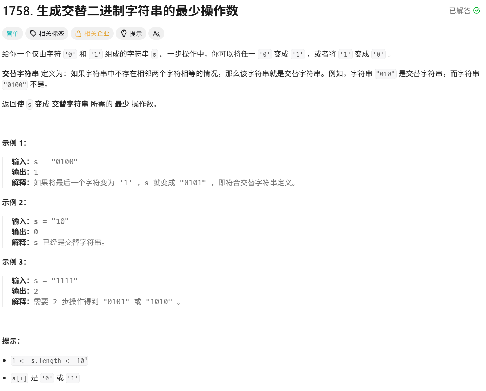

# 生成交替二进制字符串的最少操作数

> [!question] 题目描述
> 
>
>---

<br>

> [!light] 核心思路
> **破局点**：使用 **贪心算法** 分别计算两种交替模式的操作次数。
>
> 1. 计算以'0'开头的交替字符串需要的操作次数
> 2. 计算以'1'开头的交替字符串需要的操作次数
> 3. 返回两者中的最小值

<br>

> [!code] 代码实现
>
> ```cpp
> class Solution {
> public:
>     int minOperations(string s) {
>         if(s.size() == 0){
>             return 0;
>         }
>         return min(string0(s), string1(s));
>     }
>     
>     int string0(string s){
>         int count = 0;
>         for(int i = 0; i < s.size(); i++){
>             if(s[i] != '0' && i % 2 == 0 || s[i] != '1' && i % 2 == 1){
>                 count++;
>             }
>         }
>         return count;
>     }
> 
>     int string1(string s){
>         int count = 0;
>         for(int i = 0; i < s.size(); i++){
>             if(s[i] != '1' && i % 2 == 0 || s[i] != '0' && i % 2 == 1){
>                 count++;
>             }
>         }
>         return count;
>     }
> };
> ```

## 优化

> [!light] 核心思路
>
> - 交替字符串只有两种模式：010101... 和 101010...
> - 对于位置 i，如果当前字符与模式1不匹配，那么它必然与模式2匹配
> - 因此可以用一个计数器统计其中一种模式的不匹配次数，另一种模式的不匹配次数就是 n - count

> [!code] 代码实现
>
> ```cpp
> class Solution {
> public:
>     int minOperations(string s) {
>         int count = 0;
>         for (int i = 0; i < s.size(); i++) {
>             // 统计与"010101..."模式不匹配的次数
>             if (s[i] != '0' + i % 2) {
>                 count++;
>             }
>         }
>         // 返回两种模式中操作次数较少的
>         return min(count, (int)s.size() - count);
>     }
> };
> ``` 
> 