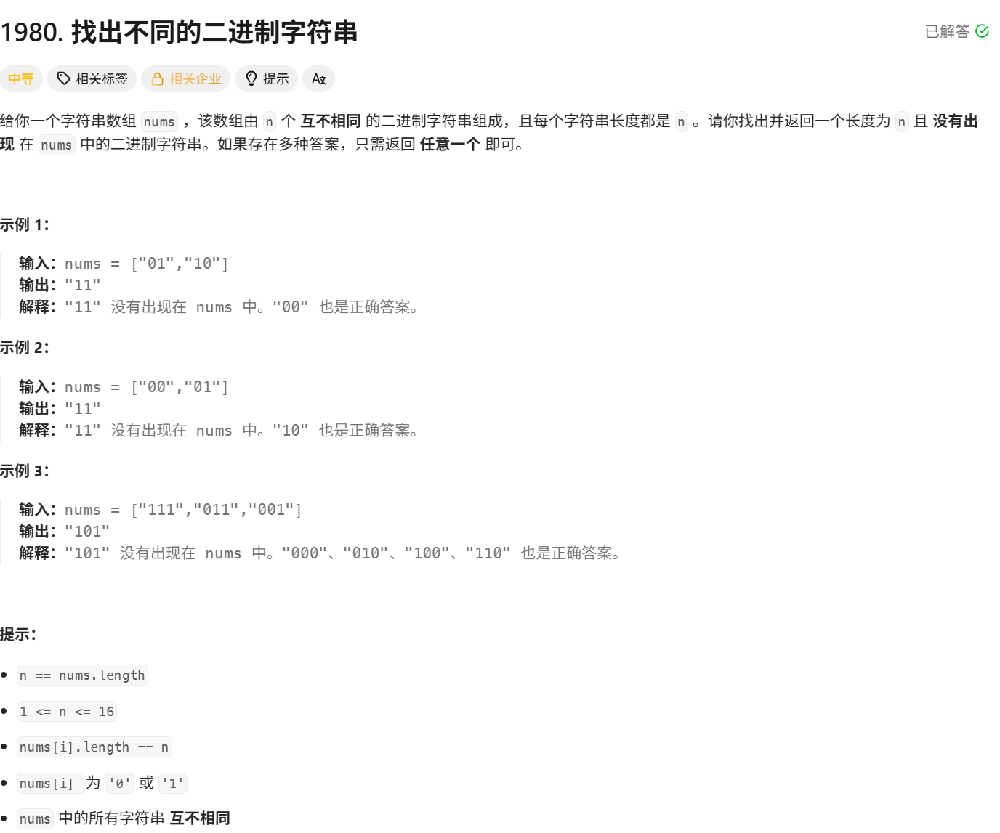

# 找出不同的二进制字符串

> [!question] 题目描述
> 
>

---

> [!light] 核心思路
> **破局点**：使用回溯算法生成所有可能的n位二进制字符串，找到第一个不在给定集合中的字符串
>
> 1. 将给定字符串数组存入哈希集合，方便快速查找
> 2. 使用回溯算法生成所有长度为n的二进制字符串
> 3. 对于每个生成的字符串，检查是否在集合中
> 4. 找到第一个不在集合中的字符串即返回

---

> [!code] 代码实现

```cpp
# include <bits/stdc++.h>
> using namespace std;
> 
> 
> /*
>  * @lc app=leetcode.cn id=1980 lang=cpp
>  *
>  * [1980] 找出不同的二进制字符串
>  */
> 
> // @lc code=start
> class Solution {
> public:
>     string findDifferentBinaryString(vector<string>& nums) {
>         unordered_set<string> s(nums.begin(), nums.end());
>         int n = nums.size();
> 
>         string result = "";
>         string curr_str = "";
>         backtrack(result, curr_str, s, n);
> 
>         return result;
>     }
> 
>     bool backtrack(string& result, string curr_str,const unordered_set<string>& s, int n){
>         if(curr_str.size() == n){
>             if(s.find(curr_str) == s.end()){
>                 result = curr_str;
>                 return true;
>             }
>         return false;
>         }
> 
>         curr_str.push_back('0');
>         if(backtrack(result, curr_str, s, n)) return true;
>         curr_str.pop_back();
> 
>         curr_str.push_back('1');
>         if(backtrack(result, curr_str, s, n)) return true;
>         curr_str.pop_back();
> 
>         return false;
>     }
> };
> // @lc code=end
> ```
