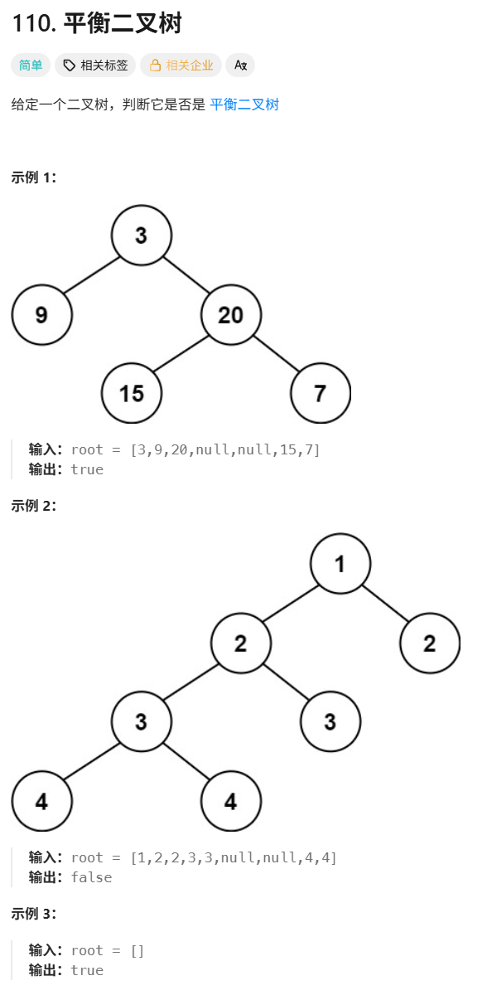

# 110平衡二叉树

题目：



解题：

```c++
/**
 * Definition for a binary tree node.
 * struct TreeNode {
 *     int val;
 *     TreeNode *left;
 *     TreeNode *right;
 *     TreeNode() : val(0), left(nullptr), right(nullptr) {}
 *     TreeNode(int x) : val(x), left(nullptr), right(nullptr) {}
 *     TreeNode(int x, TreeNode *left, TreeNode *right) : val(x), left(left), right(right) {}
 * };
 */
class Solution {
public:
    bool isBalanced(TreeNode* root) {
        int height_low = 0;
        int height_high = 0;
        
        queue<TreeNode*> q;
        q.push(root);
        
        while(!q.empty()){
            
        }
        
        return ture;
    }
};

```
