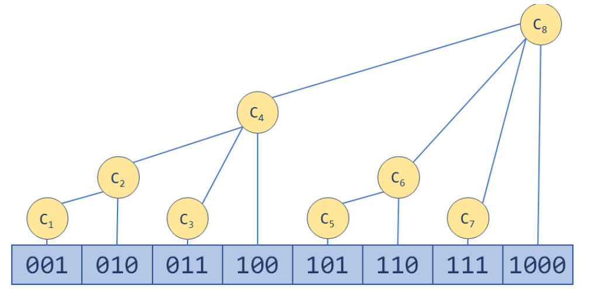

# 树状数组
 

## 定义

一种用于高效处理对一个存储数字的列表进行更新及求前缀和的数据结构。

树状数组所能解决的典型问题就是存在一个长度为n的数组，我们如何高效进行如下操作：
- update(idx, delta)：将num加到位置idx的数字上。
- prefixSum(idx)：求从数组第一个位置到第idx（含idx）个位置所有数字的和。
- rangeSum(from_idx, to_idx)：求从数组第from_idx个位置到第to_idx个位置的所有数字的和