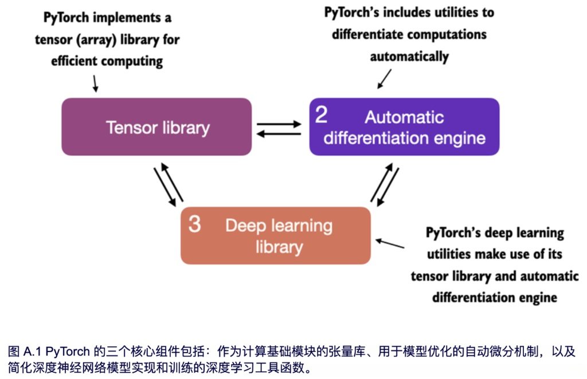
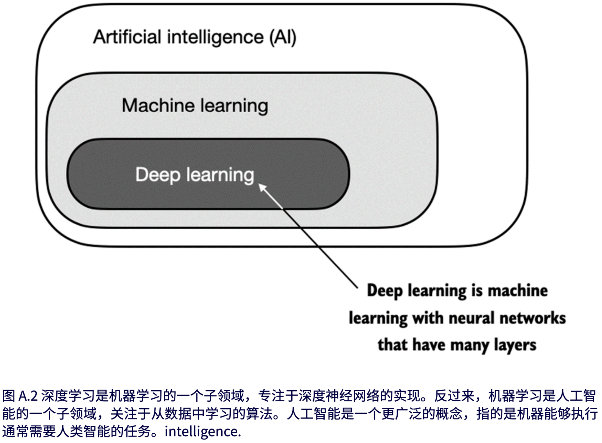
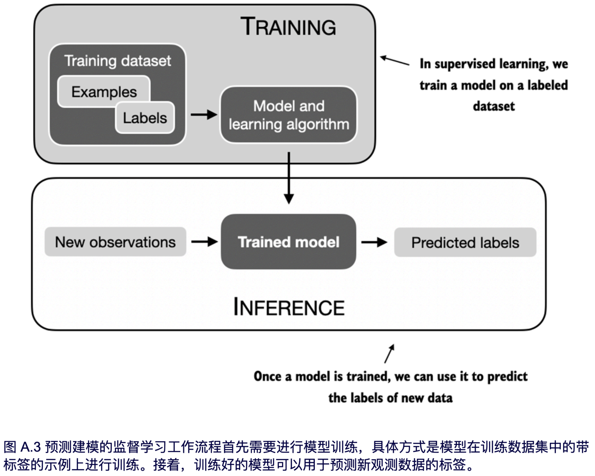
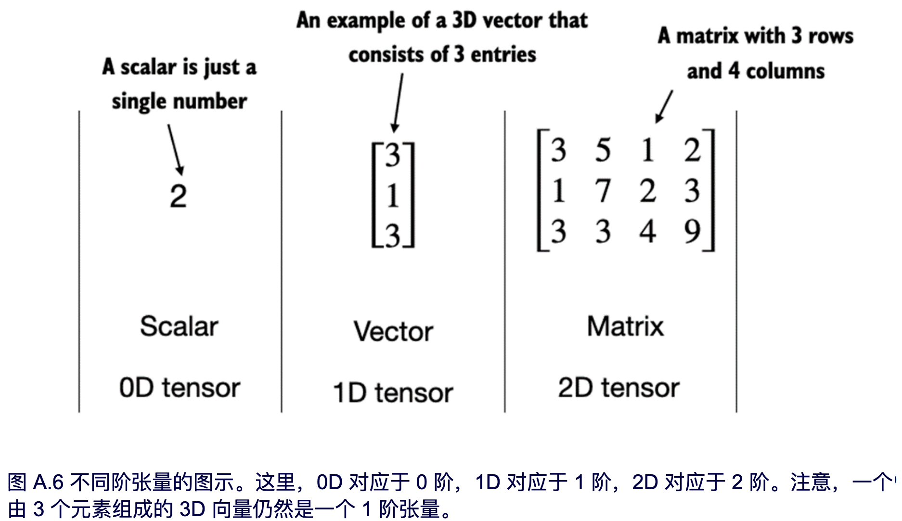

# pytorch

## 什么是pytorch

PyTorch（[https://pytorch.org/）是一个基于](https://pytorch.org/%EF%BC%89%E6%98%AF%E4%B8%80%E4%B8%AA%E5%9F%BA%E4%BA%8E) Python 的开源深度学习库。根据 [Papers With Code](https://paperswithcode.com/trends)自 2019 年以来一直是研究领域中使用最广泛的深度学习库，且领先优势明显。部分原因在于其用户友好的界面和高效性，同时并未牺牲灵活性，依然为高级用户提供了调整模型底层细节以实现定制和优化的能力

### pytorch的三个核心组件

- **张量库**：它在数组导向编程库 NumPy 的基础上扩展了功能，增加了对 GPU 加速计算的支持，从而实现了 CPU 和 GPU 之间的无缝切换。
- **自动微分引擎（ autograd）**：能够自动计算张量操作的梯度，从而简化反向传播过程和模型优化
- **深度学习库**：提供模块化、灵活和高效的构建模块（包括预训练模型、损失函数和优化器），用于设计和训练各种深度学习模型，同时满足研究人员和开发人员的需求

### 定义深度学习

深度学习是机器学习的一个子领域，专注于深度神经网络的训练和应用。
与擅长简单模式识别的传统机器学习技术不同，深度学习尤其擅长处理非结构化数据，如图像、音频或文本，因此，深度学习特别适合用于大语言模型

模型通过使用一种学习算法在包含示例及其对应标签的训练数据集上进行训练。例如，在电子邮件垃圾邮件分类器的案例中，训练数据集包含电子邮件及其由人工标注的垃圾邮件和非垃圾邮件标签。然后，训练好的模型可以用于新的观测数据（新的电子邮件），以预测它们未知的标签（垃圾邮件或非垃圾邮件）。当然，我们还需要在训练和推理阶段之间增加模型评估，以确保模型在应用于实际场景之前满足我们的性能标准。

### pytorch的安装

## 理解张量

张量代表一个将向量和矩阵向更高维度的推广的数学概念。换句话说，张量是可以用它们的阶（或秩）来描述的数学对象，阶（或秩）表示了张量的维度数量。例如，一个标量（就是一个数字）是 0 阶张量，一个向量是 1 阶张量，一个矩阵是 2 阶张量

从计算的角度来看，张量充当数据容器。张量库（例如 PyTorch）可以高效地创建、操作和计算这些多维数组。在这种情况下，张量库的作用类似于数组库。（PyTorch 张量与[numpy](../numpy/numpy.md)数组类似，但具有一些对深度学习来说很重要的额外特性。）

### 标量、向量、矩阵和张量

