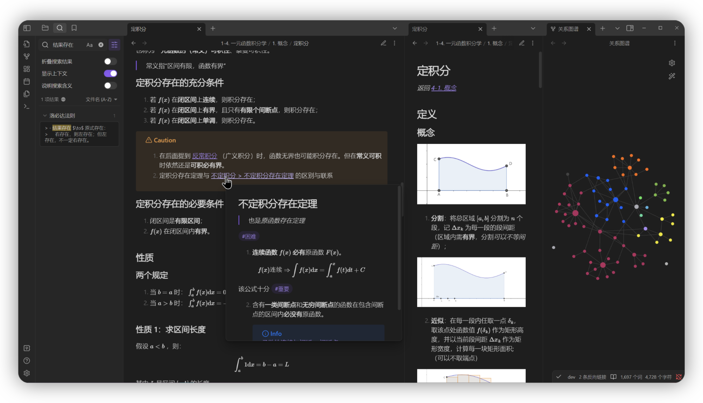

# README
## 考研数学 Obsidian 笔记本

> [!NOTE]
> 本项目遵循 `GPL-3.0` 协议开源。任何衍生项目**必须**遵守相同协议进行开源。

参考资料：2025张宇基础30讲

---

### 关于本仓库

#### 本仓库Fork

[宝宝也能看懂的考研数学笔记 - CanisAlpha](https://blandalpha.github.io/posts/math4baby_project/)

### 如何使用

本地使用只需下载本仓库并使用Obsidian打开即可。

#### Git 快捷键

1. Commit all: `Alt + C`
2. Pull: `Ctrl + Shift + -`
3. Push: `Ctrl + Shift + +`

你可以在设置中更改自己的快捷键。

### 注意事项

1. 为督促学习，每次学习后我将进行一次提交，提交备注是当前日期。若仓库进行了重大变更等，会在提交中进行额外说明。
2. 为了保证内部链接的简洁性，正文的文件名**不包含**任何排序与编码。正确浏览顺序请参考目录文件。

### 支持本项目

由于数学笔记的特殊性，免费的网站发布方法无法做到 100% 的功能覆盖（完美的公式渲染等），因此只能选择较为昂贵的官方发布。

如果你喜欢我的笔记，或者在线浏览笔记对你有一定的帮助，欢迎随意打赏。你的支持是本项目继续的动力。

   
> *有朋自远方来，不亦乐乎？*

### 鸣谢

> [!NOTE] 
> 本人已经购买该课程的正版书籍以及网课内容，如有能力请支持正版。

- 张宇老师的课程，特别是超实数部分的补充，让我有了更深刻的理解。
- YouTube上免费上传课程的博主们，让我的网课体验变得更加舒适。